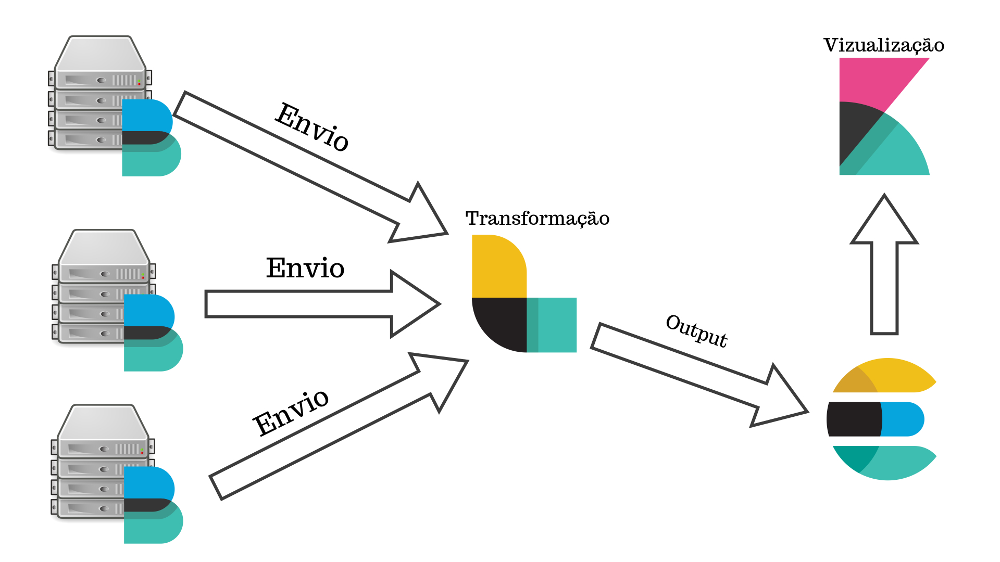
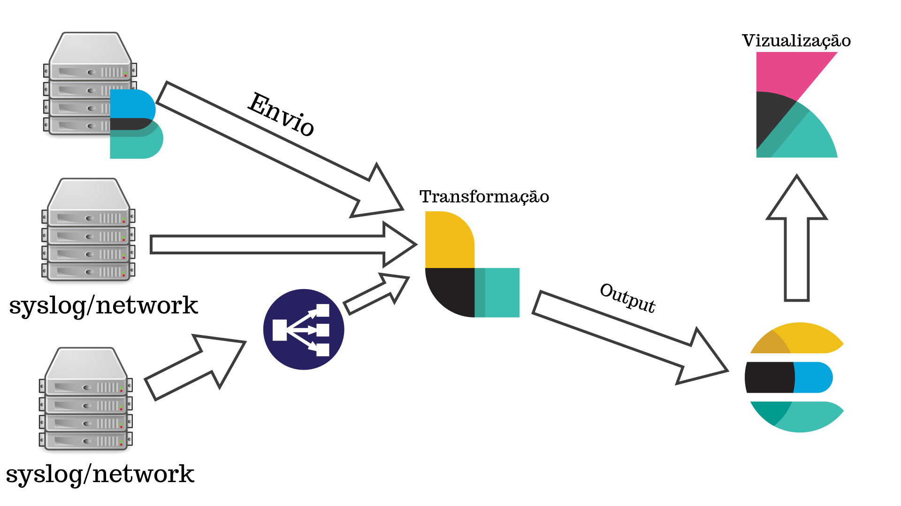
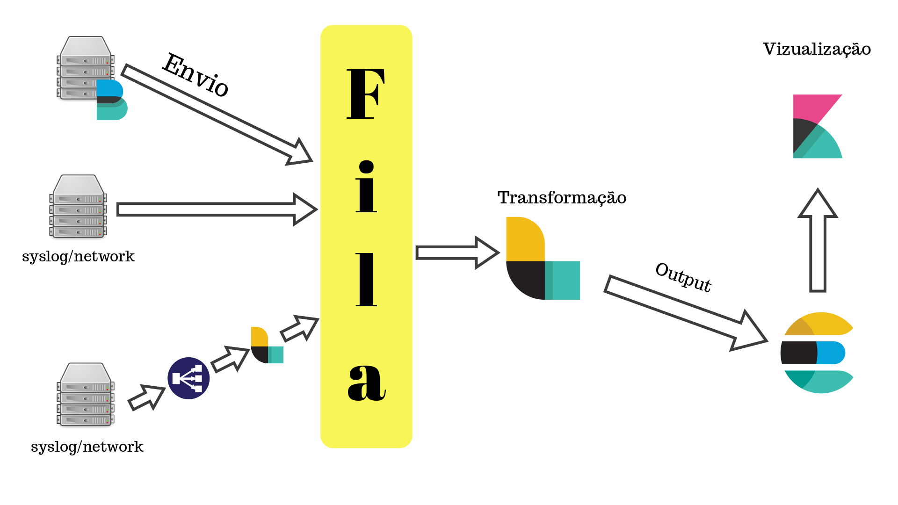

# Workshop Logstash


## Introdução

O ***Logstash*** é uma ferramenta de coleta e tratamendo de dados, com recursos em tempo real funcionando como um pipline.

A principal função do ***Logstash*** é unificar dados de diferentes fontes dinamicamente, normalizar eles em um ou vários destinos da sua escolha.

Com o ***Logstash*** você vai conseguir integrar seus dados de forma que eles fiquem visiveis por toda organização, sendo desde de dados de analise de negócio até uma analise mais aprofundada dos seus sistemas por exemplo. 

Muita das pessoas conheceram o ***Logstash*** como um grande coletor de logs, mas seus recursos vão muito além disso, qualquer tipo de evento pode ser enriquecido e transformado, graças a sua grande variedade de plugins de ***Input***, ***Filter*** e ***Output***.

Hoje o ***Logstash*** conta com vários codecs nativos que também facilitam muito a ingestão e o processo de tratamento dos dados.

## Com grandes poderes vem grandes responsabildiades

Você precisa processar muitos dados? Seus ***Logtash*** não ta dando mais conta? Basta adicionar mais nós horizontalmente e você já terá toda a sua capacidade de processamento melhorada, e um outro ponto extremamente importante que se faz necessário lembrar e que ele tem uma forte integração com ***Elasticsearch*** e ***Kibana***.


Além de tudo isso tem uma arquitetura completamente conectável! Com ***Logstash*** você será capaz de inserir dados de ***qualquer*** fonte, digerir eles e salvar também em qualquer fonte.

Isso se torna ainda mais poderoso devido ao seu grande ecossistema de plugins e ainda a capacidade de você conseguir desenvolver o seu proprio plugin!

Hoje existem mais de 200 plugins disponiveis.

## Algumas aplicações

### Logs e métricas

Capturando logs, você tera a possibilidade de capturar logs como:


- Web
- Logs de aplicação
- log4j 
- syslog
- rede
- firewall


e ainda existe a possibildiade de você fazer um socket tcp ou udp para receber e enviar dados para possiveis pontos não cobertos por plugin! 

### Web

Outro ponto possível também com o ***Logstash*** é transformar suas requisições HTTP em eventos, com isso podemos consumir serviços como:

- Twitter 
- Webhooks (github, JIRA)
- Consultar endpoints especificos

Consumindo endpoints http, podemos ainda mais crescer nossa capacidade de coletar eventos de diversas partes do nosso ecossistema.

## Datastore e streams

Essa é uma outra maneira de você conseguir dar muito mais valor aos seus dados que você tem guardado ou que são enviados via stream, exemplos:

- Coletar dados de uma base de dados relacional
- Kafka
- RabbitMQ
- SQS

### Sensores de IoT

Use o ***Logstash*** para centralizar informações de vários sensores IoT, capture dados de sensores e enriqueça esses dados para posterior analise.

Ter um grande backbone de ingestão de dados para redes de IoT é uma otima abordagem e o ***Logstash*** vai ajudar muito nisso, podendo ser o grande centralizador dessas comunicações.

## Aproveite para enriquecer tudo

Quando melhor for seus dados melhor vai ser o seu conhecimento sobre seu negócio e não importa que tipo de dado ou negócio seja.

Fazer o trabalho de limpar e transformar sua informação durante o processo de ingestão vai te trazer um ganho imediado de possiveis insights durante o processo de filtro ou até mesmo o processo de output.

O ***Logstash*** já vem com várias possibilidades já prontas, desde agregadores, modificadores, marcadores geograficos e muitos outras possibildiades já disponivies para que você use assim que acabe a instalacão.

Existem filtros como o **Grok** que vai te possibiltar encontrar padrões de uma forma mais simplificada que o uso de expressões regulares puras, outro ponto que pode te ajudar a ter uma visão melhor são as coordenads geograficas, que podem te ajudar a ter uma ideia espacial da sua informação.

Existem também filtros já prontos para arquivos do tipo CSV, facilitando a leitura desse tipo de arquivo, outro ponto importante também é a capacidade de anonimizar dados sensiveis.

Outro ponto bem importante são os codecs que nos ajudam a processar saidas do tipo JSON ou até mesmo multiline.

## Alguns exemplos do que temos dentro do Logstash

### Analise
- 	Elasticsearch
- 	MongoDB

### Arquivamento
- S3
- HDFS

### Monitoramento
- Nagios
- Ganglia
- Zabbix
- Graphite
- Datadog
- Cloudwatch

### Alerta
- Email
- IRC
- SNS
- Pagerduty

## Alguns exemplos de deploy do Logstash

Nessa primeira "Arquitetura" podemos ver um envio simples de dados para o **Logstash** sendo feito pelo **Beats**, esse seria um dos cenários mais simples de deploy do **Logstash** que poderiamos ter.



Nesse modelo, temos os agents do **Beats** coletando as informações e enviado de forma direta para o **Logstash**, esse é um cenário comum quando queremos enriquecer informações por isso colocamos o **Beats** para enviar os dados para o **Logstash**

Outro modelo de deploy que podemos ter é o **Logstash** coletando dados de outros dispositivos além dos logs que são enviados pelo **Beats**.

Nesse modelo temos a coleta de dados de locais como:
- Equipamentos de rede
- Firewalls
- Appliances
- Aplicativos
- IoT
- Sensores
- Dados relativos a segurança

Essas fontes de dados podem fazer o envio direto para o **Logstash** via syslog, tcp, udp ou qualquer outro método que seja possivel fazer essa conexão para o envio dos dados. 

Como você já sabe que o **Logstash** pode ser escalado horizontalmente, você pode enviar também os dados para um load balancer e ter os seus pipelines sendo balanceados.



Outro tipo de deploy que pode ser feito é um deploy onde enviamos os logs para um centralizador, que pode ser um servidor de fila ou um stream de dados. 

Nesse tipo de deploy você consegue garantir um grande qualidade na entrega das mensagens e também consegue ter um controle melhor do processamento delas no **Logstash**. 

Para equipamentos que não tem a capacidade de enviar os logs para um servidor de fila o ideal é colocar um servidor de **Logstash** antes para poder fazer esse envio, então equipamentos de rede, firewall e appliances são enviados para um primeiro servidor de **Logstash** que vai fazer somente o papel de **forwarder** para o servidor de filas.




## Bora começar isso?

### Instalando o Logstash
>O Logstash necessita do Java 8 ou 11 para funcionar podendo ser tanto a versão da oracle quando OpenJDK

Para verificar a sua versão do java use o comando:

```bash
java -version
```

Você deve obter uma saida parecida com essa:

```bash
openjdk version "11.0.3" 2019-04-16
OpenJDK Runtime Environment (build 11.0.3+7-Ubuntu-1ubuntu219.04.1) 
OpenJDK 64-Bit Server VM (build 11.0.3+7-Ubuntu-1ubuntu219.04.1, mixed mode, sharing)
```
Em alguns sistemas Linux e necessário ter a variável de ambiente **JAVA_HOME** exportada antes de tentar fazer a instalação, principalmente se você fez a sua instalação do Java de forma manual.

### Instalando a partir de repositórios

Estão disponiveis repositórios tanto APT quanto YUM.

As versões do **Logstash** estão distribuidas em repositórios de acordo com o número dela, por exemplo se você quer usar as versões 7.x do **Logstash** você tem que usar esse numero no seu repositório ex:

```
# Versão 7.x
deb https://artifacts.elastic.co/packages/7.x/apt stable main

# Versão 6.x
deb https://artifacts.elastic.co/packages/6.x/apt stable main

```

#### APT

Faça o Download da chave pública

```bash
wget -qO - https://artifacts.elastic.co/GPG-KEY-elasticsearch | sudo apt-key add -
```

Antes de proceguir é necessário instalar o pacote * apt-transport-https * no Debian

```bash
sudo apt-get install apt-transport-https
```

Agora salve o endereço do repositório em * /etc/apt/sources.list.d/elastic-7.x.list *

```bash
echo "deb https://artifacts.elastic.co/packages/7.x/apt stable main" | sudo tee -a /etc/apt/sources.list.d/elastic-7.x.list

```
Rode um * apt update * para deixar o repositório pronto para uso, e depois faça a instalação do *Logstash*

```bash
apt update && apt -y install logstash 
```
#### YUM

Faça o Download da chave pública

```bash
rpm --import https://artifacts.elastic.co/GPG-KEY-elasticsearch
```

Adicione a seguinte configuração no seu */etc/yum.repos.d/* criando um arquivo com sufixo *.repo*, como por exemplo *logstash.repo* 

```
[logstash-7.x]
name=Elastic repository for 7.x packages
baseurl=https://artifacts.elastic.co/packages/7.x/yum
gpgcheck=1
gpgkey=https://artifacts.elastic.co/GPG-KEY-elasticsearch
enabled=1
autorefresh=1
type=rpm-md
```
Agora seu repositório já vai estar pronto par ao uso

```bash
sudo yum install logstash
```
## Tratando seu primeiro evento

Agora que já instalamos o **Logstash** vamos fazer o teste do nosso primeiro pipeline básico!

Para que um pipeline do **Logstash** funcione são necessários no minimo dois elemetos um de *input* e um de *output*, o elemento de *filter* é opcicional.

Um pipeline então é constituido de 3 fases:
- Input responsável por consumir os dados
- Filter responsável por transformar os dados
- Output responsável por escrever os dados no destino


Bom agora que você já tem uma ideia de como funciona vamos subir nosso primeiro pipeline básico.

```bash
cd logstash-7.1.0
bin/logstash -e 'input { stdin { } } output { stdout {} }'
```

```
A localizção do binario do Logstash vai depender do tipo de instalação que você fez, no caso de ter feito via pacote do sistema operacional verifique se já está no path ou na pasta que seu SO coloca os binários
```

Quando usamos a flag -e nós especificando que vamos usar uma configruação direto da linha de comando, esse é um tipo de abordagem para você pode testar algum tipo de configuração sem precisar fazer a edição de um arquivo de configuração. 

Descrevendo o pipeline a seguir ele escuta a entrada stdin e move tudo que entrar nela para a saida padão.

Depois de iniciar o Logstash, espere até ver "Pipeline main started" e, em seguida, insira hello world no prompt de comando:

```bash
hello world
2013-11-21T01:22:14.405+0000 0.0.0.0 hello world
```
## Processando nosso primeiro Log

Bom, você já criou seu primeiro pipeline e trabalhou o seu primeiro evento, mas no mundo real as coisas não são tão simples assim, apesar de serem fáceis. No mundo real acabamos usando mais de um input, mais de um filtro e mais de um output! 

Nosso primeiro log para ser trabalhado vai ser um log de um apache, basicamente vamos pegar esse log de apache com o **Filebeat** e vamos jogar ele para o **Logstash** onde vamos tratar alguns filtros e depois gravar esse *Output* no **Elasticsearch**.

### Configurando o Filebeat para enviar os logs

Antes de você configurar o seu pipeline você vai ter que configurar o **Filebeat** para enviar os logs para o **Logstash**. O **Filebeat** é um agent extremamente leve e fácil de ser configurado, sua função e fazer a coleta de logs e enviar para algum lugar,que no nosso caso é o **Logstash**. O **Filebeat** deve ser instalado na máquina em que os logs estão sendo gerados.

Para fazer a instalação do **Filebeat** siga o seguinte [tutorial](https://www.elastic.co/downloads/beats/filebeat "Filebeat").

Vamos no nosso exemplo usar os logs do apache, para que tenhamos uma boa massa de logs vamos usar um projeto chamado **Fake Apache Log Generator**, que pode ser baixado nesse [link](https://github.com/kiritbasu/Fake-Apache-Log-Generator).

Então vamos ao processo de instalação do nosso gerador de logs fake

Primeiro passo vamos clonar o repositório

```bash
git clone git@github.com:kiritbasu/Fake-Apache-Log-Generator.git
```
Agora que já clonamos o repositório vamos fazer a instalação das dependências, para isso vamos uar o **pip** caso você não tenha ele instalado no seu sistema é necessário fazer a instalação de acordo com seu [sistema operacional](https://packaging.python.org/guides/installing-using-linux-tools/#installing-pip-setuptools-wheel-with-linux-package-managers).

```bash
pip install -r requirements.txt
```

Se tudo ocorreu certo na instalação agora podemos gerar nosso log que será consumido pelo **Filebeat** sem problemas usando o seguinte comando

```bash
python apache-fake-log-gen.py -n 100 -o LOG
```

Esse comando vai ser responsável por gerar 100 linhas log que vamos usar no nosso **Filebeat**

Agora que já temos o arquivo de logs, precisamos fazer a configuração básica do nosso **Filebeat**, para isso basta seguir os passos abaixo

1 - Faça o download do **Filebeat**
```bash
wget https://artifacts.elastic.co/downloads/beats/filebeat/filebeat-7.1.1-linux-x86_64.tar.gz
```

2 - Exploda o arquivo tar.gz

```bash
tar -zxvf filebeat-7.1.1-linux-x86_64.tar.gz
```

3 - Temos que habilitar o módulo que vamos usar, que no nosso caso será o *apache*, execute o filebeat com a seguinte sintaxe

```bash
./filebeat modules enable apache 
```

4 - Agora vamos fazer a configuração do módulo do apache, aqui não vou me pegar em detalhes da configuração do **Filebeat** apenas vou fazer com que ele envie os logs para onde precisamos

Edite o arquivo *apache.yml* dentro do diretorio *modules.d* presente no diretório de configuração do **Filebeat**

```bash
# Module: apache
# Docs: https://www.elastic.co/guide/en/beats/filebeat/7.1/filebeat-module-apache.html

- module: apache
  # Access logs
  access:
    enabled: true

    # Set custom paths for the log files. If left empty,
    # Filebeat will choose the paths depending on your OS.
    var.paths:
      # Aqui vai o caminho para o path dos logs
      - /home/eth0/projetos/Fake-Apache-Log-Generator/*.log

  # Error logs
  error:
    enabled: false

    # Set custom paths for the log files. If left empty,
    # Filebeat will choose the paths depending on your OS.
    #var.paths:

```
5 - Proximo passo é configurar o *output* do nosso log, no caso do **Filebeat** nós poderiamos jogar ele direto para o **Elasticsearch**, mas no nosso caso iremos colocar ele no **Logstash** para enriquecer um pouco a informação.

Para isso, você deve editar o arquivo *filebeat.yml*

```bash
...
#----------------------------- Logstash output --------------------------------
output.logstash:
  # The Logstash hosts
  hosts: ["localhost:5044"]

  # Optional SSL. By default is off.
  # List of root certificates for HTTPS server verifications
  #ssl.certificate_authorities: ["/etc/pki/root/ca.pem"]

  # Certificate for SSL client authentication
  #ssl.certificate: "/etc/pki/client/cert.pem"

  # Client Certificate Key
  #ssl.key: "/etc/pki/client/cert.key"
...
 	
```

Agora já temos o **Filebeat** pronto para fazer o envio dos logs para o **Logstash**, nosso proximo passo é subir o nosso logstash, para isso vamos usar o *docker-compose* que está no nosso [repositorio](https://github.com/eduardo-eth0/workshop-logstash).

Bom primerio passo é copiar nosso arquivo de configuração para a pasta que vai ser mapeada dentro do container docker do **Logstash**

```bash
cp files/beats.conf pipeline/beats.conf
```

Agora vamos subir nosso ecossistema completo

```bash
sudo docker-compose -f "docker-compose.yml" up
```
Agora vamos subir nosso **Filebeat** para fazer o envio dos logs, vá até o diretório onde o filebeat está instalado e execute o comando.

```bash
./filebeat
```
Como tudo isso funcionou? Bom, vamos ver agora nosso arquivo de configuração e discutir ele passo a passo

```bash
input {
  beats {
    port => 5044
  }
}

filter {
  grok {
    match => { "message" => "%{COMBINEDAPACHELOG}" }
  }
  geoip {
    source => "clientip"
  }

  mutate {
    remove_field => ["message","[agent][version]","[agent][ephemeral_id]","[agent][id]","[host][architecture]"]
  }

  translate {
    field => "[response]"
    destination => "[response_description]"
    dictionary => {
        "100" => "Continue"
        "101" => "Switching Protocols"
        "200" => "OK"
        "301" => "Moved Permanently"
        "304" => "Not Modified"
        "400" => "Bad Request"
        "403" => "Forbidden"
        "409" => "Conflict"
        "500" => "Server Error"
      }
      fallback => "No description"
  }
  
  if [geoip.country_name] == "United States" {
    mutate { 
      add_field => { "gringos" => "Yes" }
    }
  } else {
    mutate {
      add_field => { "gringos" => "No" }
    }
  }

}
output {
    stdout {
      codec => rubydebug
    }
    elasticsearch {
      hosts => "elasticsearch:9200"
      manage_template => false
      index => "%{[@metadata][beat]}-%{[@metadata][version]}-%{+YYYY.MM.dd}" 
    }
}

```
## Buscando dados em uma base de dados

Nosso próximo pipeline agora vai ser sobre como consumir um arquivo csv, e enriquecer essa informação fazendo a busca em uma base de dados.

```bash
input {
    file{
        path => "/tmp/sample_csv/sample.csv"
    }
}
filter {
    csv {
        columns => ["id","value"]
    }

    jdbc_static {
        jdbc_user => "root"
        jdbc_password => "x"
        jdbc_driver_library => "/tmp/connector/mysql-connector-java-8.0.16.jar"
        jdbc_driver_class => "com.mysql.cj.jdbc.Driver"
        jdbc_connection_string => "jdbc:mysql://mysql:3306/customer"
        
        loaders => [
            {
                id => "remote-customers"
                query => "select id,first_name,last_name, email, gender from user_data"
                local_table => "customers"
            }
        ]
        local_db_objects => [
            {
                name => "customers"
                index_columns => ["id"]
                columns => [
                    ["id","varchar(10)"],
                    ["first_name","varchar(255)"],
                    ["last_name","varchar(255)"],
                    ["email","varchar(255)"],
                    ["gender","varchar(255)"]
                ]
            }
        ]
        local_lookups => [
            {
                id => "local-customers"
                query => "select email,first_name,last_name,gender from customers where id = :id"
                parameters => { id => "[id]"}
                target => "customer"
            }
        ]

        loader_schedule => "*/30 * * * *"

        add_field => { customer_email => "%{[customer][0][email]}"}
        add_field => { first_name => "%{[customer][0][first_name]}"}
        add_field => { last_name => "%{[customer][0][last_name]}"}
        add_field => { gender => "%{[customer][0][gender]}"}
    }
}
output {
    stdout {
      codec => rubydebug
    }
    elasticsearch {
      hosts => "elasticsearch:9200"
      manage_template => false
      index => "customer-%{+YYYY.MM.dd}" 
    }
}
```
## Conversando com API

```bash
input {
    http_poller {
        urls => {
            todos => {
                # Supports all options supported by ruby's Manticore HTTP client
                method => get
                url => "https://jsonplaceholder.typicode.com/albums"
                headers => {
                    Accept => "application/json"
                }
            }
        }
        request_timeout => 60
        schedule => { cron => "*/5 * * * *"}
        codec => "json"
        metadata_target => "http_poller_metadata"
    }
}
filter {
    http {
        url => "https://jsonplaceholder.typicode.com/users"
        verb => "GET"
        query => {
            "id" => "%{[userId]}"
        }
        body_format => "json"
        add_field => { username => "%{[body][0][username]}"}
    }
}
output {
    stdout {}
    email {
        to => "test@logstash.com"
        from => "logstash@test.com"
        subject => 'Alert '
        body => "Tags: tag\\n\\Content:\\n%adfasdf"
        address => "mailcatcher"
        port => "1025" 
    }

    http {
        url => "https://api.telegram.org/bot865012397:AAFd-GrFo79vRIXUZIDQLggEdgPew9dGcz8/sendMessage?chat_id=685316770"
        format => "message"
        content_type => "application/json"
        http_method => "post"
        message => ' {
            "text": "O usuário %{[body][0][username]} criou um album novo"
        }'
    }
}
```

